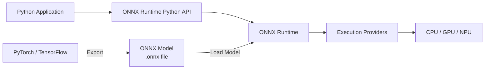
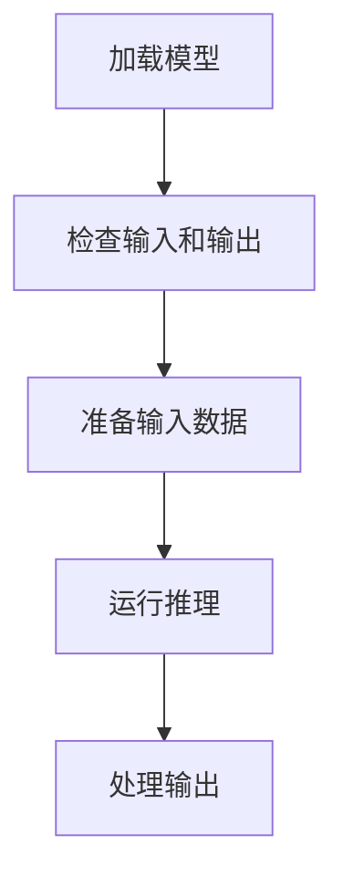
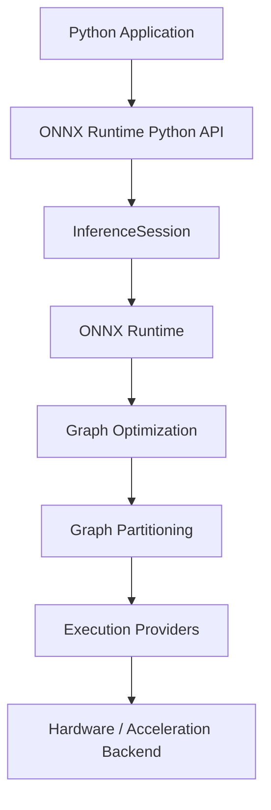

# ONNX Runtime 概述

## 什么是 ONNX？

**ONNX**（Open Neural Network Exchange，开放神经网络交换）是一种用于表示机器学习模型的开放格式。

它提供了一种通用的模型表示方式，使得使用不同机器学习框架训练的模型能够在不同工具和运行时之间进行转换。

例如，使用 PyTorch 训练的模型可以导出为 ONNX 格式，并使用 ONNX Runtime 执行。

## 什么是 ONNX Runtime？

**ONNX Runtime** 是一个跨平台的推理引擎，用于执行 ONNX 格式的机器学习模型。

它提供了将模型推理集成到应用程序中的 API，包括：

- 加载 ONNX 模型
- 创建推理会话
- 运行推理
- 配置执行提供程序

## ONNX 与 ONNX Runtime 的关系



ONNX 定义了模型表示，而 ONNX Runtime 提供了执行 ONNX 模型的运行时环境。

模型通常使用 PyTorch 或 TensorFlow 等机器学习框架创建和训练，然后导出为 ONNX 格式，以便使用 ONNX Runtime 进行推理。

## ONNX Runtime Python API

ONNX Runtime 提供了用于加载模型和运行推理的 Python API。详情请参阅 [InferenceSession API 参考](../python-api/inference-session.md)。

---

# 安装 ONNX Runtime

本节介绍如何为 Python 应用程序安装 ONNX Runtime，并验证安装。

## 先决条件

安装 ONNX Runtime 之前，请确保：

- 您的环境中已安装 Python。
- 您的 Python 版本受您计划安装的 ONNX Runtime 版本支持。
- 已安装 `pip`，可用于安装 Python 包。

有关最新 Python 版本要求和环境兼容性信息，请参阅 [ONNX Runtime 兼容性文档](https://onnxruntime.ai/docs/reference/compatibility.html)。

## 安装 ONNX Runtime

ONNX Runtime 为不同的执行环境提供了不同的 Python 包。

| 包 | 使用场景 |
|---|---|
| `onnxruntime` | 在 CPU 上运行推理 |
| `onnxruntime-gpu` | 使用受支持的 GPU 执行提供程序运行推理 |

在本指南的示例中，使用 CPU 包。它为学习 ONNX Runtime Python API 提供了最简单的设置。

> **注意：** 不要在同一 Python 环境中同时安装 `onnxruntime` 和 `onnxruntime-gpu`。

### 安装 CPU 包

```bash
pip install onnxruntime
```

### 安装 GPU 包

如果您的应用程序需要 GPU 加速，请安装 GPU 包：

```bash
pip install onnxruntime-gpu
```

GPU 执行需要额外的依赖项和兼容的执行提供程序。有关 GPU 特定要求，请参阅 [ONNX Runtime 安装文档](https://onnxruntime.ai/docs/install/)。

## 安装示例依赖项

第一个推理示例还使用了 NumPy 和 Pillow 进行输入预处理。

```bash
pip install numpy pillow
```

## 验证安装

安装 ONNX Runtime 后，验证该包可以成功导入。

```python
import onnxruntime as ort

print(ort.__version__)
```

如果安装成功，该命令会打印已安装的 ONNX Runtime 版本。

## 下一步

验证安装后，继续阅读 [运行您的第一次推理](first-inference.md)。

---

# 运行您的第一次推理

本节展示如何使用 ONNX Runtime Python API 对手写数字图像运行 `mnist-8.onnx` 模型的推理。

## 先决条件

开始之前，请确保：

- 已安装 ONNX Runtime。请参阅 [安装 ONNX Runtime](installation.md)。
- 已安装 NumPy 和 Pillow：

```bash
pip install numpy pillow
```

## 示例文件

该示例使用以下文件：

| 文件 | 描述 |
|---|---|
| `quickstart.py` | 完整的推理脚本 |
| `mnist-8.onnx` | 用于手写数字识别的 ONNX 模型 |
| `digit.png` | 示例使用的输入图像 |

示例文件位于项目仓库的 `examples/` 目录中。

要开始使用，请克隆仓库：

```bash
git clone https://github.com/your-username/doc-engineering-demo.git
cd doc-engineering-demo
```

## 运行示例

从仓库根目录运行完整示例：

```bash
python examples/quickstart.py
```

脚本会打印示例图像的预测数字：

```text
Predicted digit: 6
```

输出取决于输入图像。如果使用不同的图像，预测数字可能会改变。

## 理解代码

### 加载模型

```python
import onnxruntime as ort

session = ort.InferenceSession("mnist-8.onnx")
```

`InferenceSession` 加载模型并为推理准备运行时会话。

### 预处理输入图像

MNIST 模型期望输入是 `[1, 1, 28, 28]` 的 float32 张量，表示一张灰度图像。像素值被归一化到 `[0.0, 1.0]`。

```python
from PIL import Image
import numpy as np

# 读取并转换为灰度
image = Image.open("digit.png").convert("L")

# 调整大小为 28×28
image = image.resize((28, 28))

# 归一化到 [0, 1]
img_array = np.array(image).astype(np.float32) / 255.0

# 匹配模型输入形状
input_data = img_array.reshape(1, 1, 28, 28)
```

### 运行推理

```python
input_name = session.get_inputs()[0].name
outputs = session.run(None, {input_name: input_data})
```

脚本动态获取模型的输入名称，并将其用作输入字典的键。

- 第一个参数 `None` 表示请求所有模型输出。
- 第二个参数将模型输入名称映射到输入张量。

### 获取预测

```python
predicted_digit = np.argmax(outputs[0])
print("Predicted digit:", predicted_digit)
```

对于这个分类模型，`np.argmax()` 返回最高输出分数的索引，即预测的数字。

---

# 核心工作流：适用于任何模型的五个步骤

一旦你有了 ONNX 模型，ONNX Runtime Python API 中的基本推理工作流可以描述为五个步骤。



本页使用一个通用模型来解释工作流。具体的输入预处理和输出处理取决于模型。

## 步骤 1：加载模型

创建 [`InferenceSession`](../python-api/inference-session.md) 来加载 ONNX 模型：

```python
import onnxruntime as ort

session = ort.InferenceSession("your-model.onnx")
```

会话加载模型并为推理准备运行时环境。

## 步骤 2：检查输入和输出

每个模型都有自己的输入和输出名称、形状和类型。在准备输入数据之前，请先检查模型接口：

```python
for inp in session.get_inputs():
    print(f"Input: name={inp.name}, shape={inp.shape}, type={inp.type}")

for out in session.get_outputs():
    print(f"Output: name={out.name}, shape={out.shape}, type={out.type}")
```

有关这些方法的详细信息，请参阅 [`get_inputs()`](../python-api/inference-session.md#get_inputs) 和 [`get_outputs()`](../python-api/inference-session.md#get_outputs)。

使用返回的元数据来准备与模型要求匹配的输入数据。

## 步骤 3：准备输入数据

创建与模型期望的形状和类型匹配的输入数据：

```python
import numpy as np

# 替换为与模型接口匹配的数据
input_data = np.array([...], dtype=np.float32)
```

具体的预处理取决于模型。例如：

- 图像模型可能需要调整大小、归一化和通道重排。
- 文本模型可能需要分词和转换为张量。
- 表格模型可能需要特征缩放。

请务必查阅模型文档以了解模型特定的预处理要求。

## 步骤 4：运行推理

将输入数据传递给 [`session.run()`](../python-api/inference-session.md#run)：

```python
input_name = session.get_inputs()[0].name
outputs = session.run(None, {input_name: input_data})
```

- 第一个参数 `None` 表示请求所有模型输出。
- 第二个参数将输入名称映射到输入张量。

## 步骤 5：处理输出

模型输出是数值。根据模型的输出定义将它们转换为有意义的结果。

例如，对于分类模型：

```python
result = np.argmax(outputs[0])
print(result)
```

输出的解释取决于模型。请参阅模型文档以了解输出格式和语义。

---

# InferenceSession API 参考

本章提供 `InferenceSession` 类的参考信息，它是使用 ONNX Runtime 运行推理的主要 Python 接口。

## 概述

`InferenceSession` 将 ONNX 模型加载到内存中，并公开用于检查模型元数据和执行推理的方法。

```python
import onnxruntime as ort

session = ort.InferenceSession("model.onnx")
```

一个会话可以重复用于多次 `run()` 调用，而无需重新加载模型。

---

## 构造函数

```python
ort.InferenceSession(
    path_or_bytes,
    sess_options=None,
    providers=None,
)
```

| 参数 | 类型 | 必需 | 描述 |
|---|---|---|---|
| `path_or_bytes` | `str` 或 `bytes` | 是 | ONNX 模型文件的路径，或序列化的模型字节。 |
| `sess_options` | `SessionOptions` | 否 | 会话级别的配置，例如线程数和图优化设置。 |
| `providers` | `list[str]` | 否 | 要使用的执行提供程序列表，按优先级顺序指定。如果省略，ONNX Runtime 将使用可用的提供程序及其默认优先级。 |

---

## 方法

### `get_inputs()`

返回所有模型输入的元数据。

```python
inputs = session.get_inputs()
```

**返回：** `NodeArg` 对象的列表。

| 属性 | 描述 |
|---|---|
| `name` | 输入节点名称。在 `run()` 中用作键。 |
| `shape` | 期望的张量维度，例如 `[1, 3, 224, 224]`。 |
| `type` | 期望的数据类型，例如 `tensor(float)`。 |

**示例：**

```python
for inp in session.get_inputs():
    print(f"name={inp.name}, shape={inp.shape}, type={inp.type}")
```

---

### `get_outputs()`

返回所有模型输出的元数据。

```python
outputs = session.get_outputs()
```

**示例：**

```python
for out in session.get_outputs():
    print(f"name={out.name}, shape={out.shape}, type={out.type}")
```

---

### `run()`

使用给定的输入数据执行推理。

```python
outputs = session.run(
    output_names=None,
    input_feed={},
    run_options=None,
)
```

| 参数 | 类型 | 必需 | 描述 |
|---|---|---|---|
| `output_names` | `list[str]` 或 `None` | 否 | 要返回的输出名称。传入 `None` 返回所有输出。 |
| `input_feed` | `dict` | 是 | 将输入名称映射到输入数据。键必须与模型输入名称匹配。 |
| `run_options` | `RunOptions` | 否 | 每次调用的执行设置。对于大多数用例是可选的。 |

**返回：** 包含所请求模型输出的列表。

**示例：**

```python
input_name = session.get_inputs()[0].name
outputs = session.run(None, {input_name: input_data})
```

---

### `get_providers()`

返回为会话注册的执行提供程序。

```python
providers = session.get_providers()
print(providers)
```

**示例输出：**

```text
['CPUExecutionProvider']
```

当您需要检查哪些执行提供程序可用于会话时，可以使用此方法。

---

# 理解 ONNX Runtime 架构

ONNX Runtime 将面向应用程序的 API 与准备和执行模型的组件分离。

理解此架构有助于开发人员理解模型执行和执行提供程序的选择。

## 架构概述

下图展示了 Python 应用程序的简化执行路径：



主要组件具有不同的职责：

| 组件 | 职责 |
|---|---|
| Python 应用程序 | 提供模型输入并消费推理结果 |
| ONNX Runtime Python API | 提供 ONNX Runtime 的应用程序接口 |
| `InferenceSession` | 加载模型并管理推理会话 |
| ONNX Runtime | 构建并管理模型执行图 |
| 图优化 | 应用可以提升执行效率的图变换 |
| 图划分 | 根据可用的执行提供程序将图划分为子图 |
| 执行提供程序 | 提供 ONNX Runtime 与特定硬件或加速后端之间的接口 |
| 硬件/加速后端 | 执行分配给相应执行提供程序的操作 |

## InferenceSession

[`InferenceSession`](../python-api/inference-session.md) 是运行 ONNX 模型的主要 Python 接口。

当应用程序创建一个会话时，ONNX Runtime 会加载模型并准备执行环境。

```python
import onnxruntime as ort

session = ort.InferenceSession("model.onnx")
```

会话提供以下方法：

- 检查模型输入和输出
- 运行推理
- 配置会话选项
- 选择执行提供程序

例如：

```python
outputs = session.run(None, inputs)
```

应用程序不会直接调用单个算子或硬件内核。ONNX Runtime 通过其运行时组件和执行提供程序管理模型执行。

## 图优化

ONNX Runtime 可以应用图优化来提高执行效率。

根据优化和执行配置，优化可能：

- 简化计算图
- 消除不必要的操作
- 合并兼容的操作
- 提高执行性能

图优化由 ONNX Runtime 处理，通常对应用程序是透明的。

## 图划分

模型图准备好后，ONNX Runtime 可以根据可用执行提供程序的能力对其进行划分。

当有多个提供程序可用时，不同的子图可以分配给不同的提供程序。

这允许受支持的操作通过适当的执行提供程序运行，而其他操作在适用时可以回退到另一个已配置的提供程序。

## 执行提供程序

执行提供程序（EPs）将 ONNX Runtime 连接到特定的硬件或加速库。

示例包括用于以下各项的提供程序：

- CPU
- NVIDIA CUDA
- TensorRT
- DirectML
- 其他受支持的硬件后端

应用程序可以在创建 `InferenceSession` 时指定执行提供程序：

```python
session = ort.InferenceSession(
    "model.onnx",
    providers=["CUDAExecutionProvider", "CPUExecutionProvider"]
)
```

提供程序顺序决定了提供程序被考虑执行的优先级。

如果配置了多个提供程序，ONNX Runtime 可以划分模型图，并将受支持的子图分配给适当的提供程序。

> **注意：** GPU 执行提供程序可能需要额外的包、库、驱动程序或其他环境依赖项。

## 模型执行

执行路径可以总结为：

```text
Python Application
        ↓
ONNX Runtime Python API
        ↓
InferenceSession
        ↓
Load ONNX Model
        ↓
Graph Optimization
        ↓
Graph Partitioning
        ↓
Execution Providers
        ↓
Hardware / Acceleration Backend
        ↓
Inference Results
```

确切的执行路径取决于模型、会话配置和可用的执行提供程序。

## 为什么此架构很重要

理解架构有助于开发人员：

- 选择适当的执行提供程序
- 了解模型操作如何分配给提供程序
- 推理硬件兼容性
- 调查推理性能
- 了解与提供程序相关的执行行为

有关一般推理过程，请参阅 [适用于任何模型的五个步骤](../core-flow/five-steps.md)。

有关 Python API 详细信息，请参阅 [InferenceSession API 参考](../python-api/inference-session.md)。