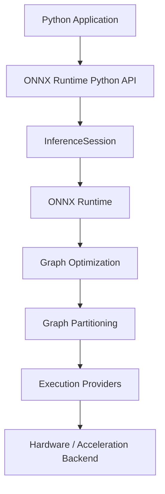

# Understanding ONNX Runtime Architecture

ONNX Runtime separates the application-facing API from the components that prepare and execute a model.

Understanding this architecture helps developers reason about model execution and execution-provider selection.

## Architecture Overview

The following diagram shows a simplified execution path for a Python application:



The main components have different responsibilities:

| Component | Responsibility |
|---|---|
| Python Application | Provides model inputs and consumes inference results |
| ONNX Runtime Python API | Provides the application interface to ONNX Runtime |
| `InferenceSession` | Loads the model and manages an inference session |
| ONNX Runtime | Builds and manages the model execution graph |
| Graph Optimization | Applies graph transformations that can improve execution efficiency |
| Graph Partitioning | Divides the graph into subgraphs that can be assigned to available execution providers |
| Execution Provider | Provides an interface between ONNX Runtime and a specific hardware or acceleration backend |
| Hardware / Acceleration Backend | Executes operations assigned to the corresponding execution provider |

## InferenceSession

[`InferenceSession`](../python-api/inference-session.md) is the primary Python interface for running an ONNX model.

When an application creates a session, ONNX Runtime loads the model and prepares the execution environment.

```python
import onnxruntime as ort

session = ort.InferenceSession("model.onnx")
```

The session provides methods for:

- Inspecting model inputs and outputs
- Running inference
- Configuring session options
- Selecting execution providers

For example:

```python
outputs = session.run(None, inputs)
```

The application does not directly invoke individual operators or hardware kernels. ONNX Runtime manages model execution through its runtime components and execution providers.

## Graph Optimization

ONNX Runtime can apply graph optimizations to improve execution efficiency.

Depending on the optimization and execution configuration, optimizations may:

- Simplify the computation graph
- Eliminate unnecessary operations
- Combine compatible operations
- Improve execution performance

Graph optimization is handled by ONNX Runtime and is generally transparent to the application.

## Graph Partitioning

After the model graph is prepared, ONNX Runtime can partition it according to the capabilities of the available execution providers.

Different subgraphs can be assigned to different providers when multiple providers are available.

This allows supported operations to run through an appropriate execution provider while other operations can fall back to another configured provider when applicable.

## Execution Providers

Execution Providers (EPs) connect ONNX Runtime to specific hardware or acceleration libraries.

Examples include providers for:

- CPU
- NVIDIA CUDA
- TensorRT
- DirectML
- Other supported hardware backends

An application can specify execution providers when creating an `InferenceSession`:

```python
session = ort.InferenceSession(
    "model.onnx",
    providers=["CUDAExecutionProvider", "CPUExecutionProvider"]
)
```

The provider order determines the priority in which providers are considered for execution.

If multiple providers are configured, ONNX Runtime can partition the model graph and assign supported subgraphs to the appropriate provider.

> **Note:** GPU execution providers may require additional packages, libraries, drivers, or other environment dependencies.

## Model Execution

The execution path can be summarized as:

```text
Python Application
        ↓
ONNX Runtime Python API
        ↓
InferenceSession
        ↓
Load ONNX Model
        ↓
Graph Optimization
        ↓
Graph Partitioning
        ↓
Execution Providers
        ↓
Hardware / Acceleration Backend
        ↓
Inference Results
```

The exact execution path depends on the model, session configuration, and available execution providers.

