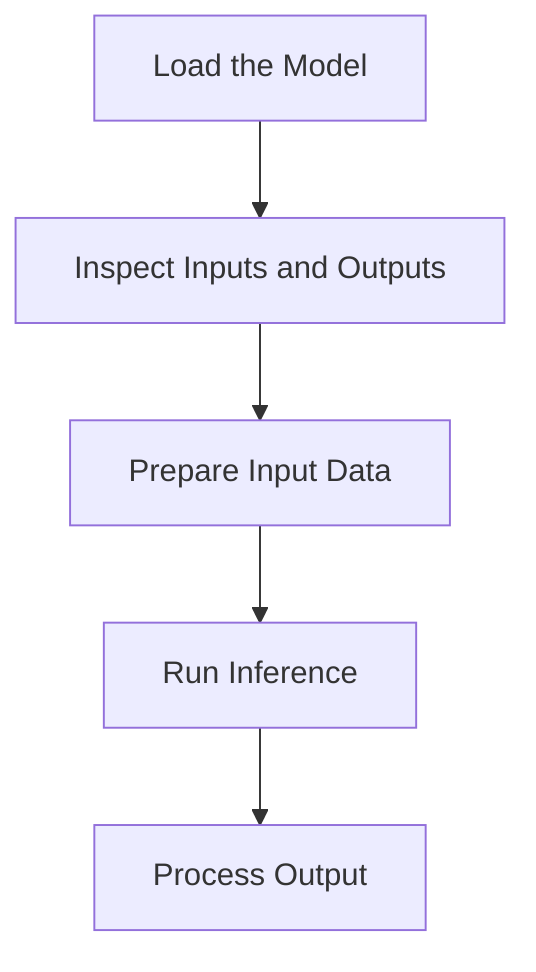

# Core Workflow: Five Steps for Any Model

Once you have an ONNX model, the basic inference workflow in the ONNX Runtime Python API can be described in five steps.



This page uses a generic model to explain the workflow. The exact input preprocessing and output processing depend on the model.

## Step 1: Load the Model

Create an [`InferenceSession`](../python-api/inference-session.md) to load the ONNX model:

```python
import onnxruntime as ort

session = ort.InferenceSession("your-model.onnx")
```

The session loads the model and prepares the runtime environment for inference.

## Step 2: Inspect Inputs and Outputs

Every model has its own input and output names, shapes, and types. Inspect the model interface before preparing input data:

```python
for inp in session.get_inputs():
    print(f"Input: name={inp.name}, shape={inp.shape}, type={inp.type}")

for out in session.get_outputs():
    print(f"Output: name={out.name}, shape={out.shape}, type={out.type}")
```

For details on these methods, see [`get_inputs()`](../python-api/inference-session.md#get_inputs) and [`get_outputs()`](../python-api/inference-session.md#get_outputs).

Use the returned metadata to prepare input data that matches the model requirements.

## Step 3: Prepare Input Data

Create input data that matches the model's expected shape and type:

```python
import numpy as np

# Replace with data that matches the model interface
input_data = np.array([...], dtype=np.float32)
```

The exact preprocessing depends on the model. For example:

- Image models may require resizing, normalization, and channel reordering.
- Text models may require tokenization and tensor conversion.
- Tabular models may require feature scaling.

Always consult the model's documentation for model-specific preprocessing requirements.

## Step 4: Run Inference

Pass the input data to [`session.run()`](../python-api/inference-session.md#run):

```python
input_name = session.get_inputs()[0].name
outputs = session.run(None, {input_name: input_data})
```

- The first argument, `None`, requests all model outputs.
- The second argument maps the input name to the input tensor.

## Step 5: Process Output

Model outputs are numerical values. Convert them into meaningful results according to the model's output definition.

For example, for a classification model:

```python
result = np.argmax(outputs[0])
print(result)
```

The interpretation of the output depends on the model. Refer to the model's documentation to understand the output format and semantics.