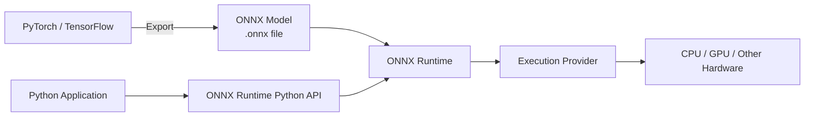
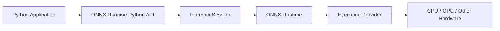

# ONNX Runtime Overview

This page introduces ONNX and ONNX Runtime, explains how they work together, and shows how a Python application uses ONNX Runtime for inference.

## What Is ONNX?

**ONNX** (Open Neural Network Exchange) is an open format for representing machine learning models.

It provides a common model representation that allows models developed with different machine learning frameworks to be transferred to different tools and runtimes.

For example, a model developed with PyTorch can be exported to the ONNX format and then loaded by ONNX Runtime for inference.

## What Is ONNX Runtime?

**ONNX Runtime** is a cross-platform inference engine for executing machine learning models in the ONNX format.

For Python applications, ONNX Runtime provides APIs for:

- Loading ONNX models
- Creating inference sessions
- Inspecting model inputs and outputs
- Running inference
- Configuring execution providers

## ONNX and ONNX Runtime

ONNX defines how a machine learning model is represented, while ONNX Runtime provides the software environment for executing the model.

A typical workflow is:

In a typical workflow:

1. A model is developed or trained using a machine learning framework such as PyTorch or TensorFlow.
2. The model is exported to the ONNX format.
3. A Python application loads the ONNX model through the ONNX Runtime Python API.
4. ONNX Runtime executes the model using a configured execution provider.
5. The execution provider runs the model on the available hardware.

The model creation and training process is outside the scope of this guide. This guide focuses on using ONNX Runtime to run inference from Python applications.

## How Python Applications Use ONNX Runtime

A Python application interacts with ONNX Runtime through its Python API rather than directly managing hardware execution.

The basic relationship is:

Each component has a different role:

| Component                  | Role                                                      |
| -------------------------- | --------------------------------------------------------- |
| Python Application         | Provides model input data and processes inference results |
| ONNX Runtime Python API    | Provides the application-facing interface                 |
| `InferenceSession`         | Loads the model and manages an inference session          |
| ONNX Runtime               | Executes the ONNX model                                   |
| Execution Provider         | Connects ONNX Runtime to a specific hardware backend      |
| CPU / GPU / Other Hardware | Executes the model operations                             |

For most Python applications, developers work primarily with the Python API and `InferenceSession`. ONNX Runtime handles the underlying model execution.

