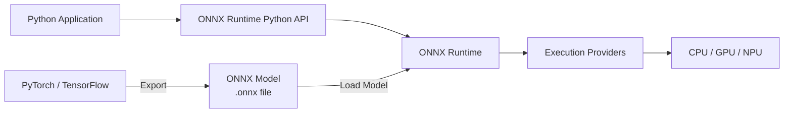

# ONNX Runtime Overview

## What is ONNX?

**ONNX** (Open Neural Network Exchange) is an open format for representing machine learning models.

It provides a common model representation that allows models trained with different machine learning frameworks to be transferred across different tools and runtimes.

For example, a model trained with PyTorch can be exported to the ONNX format and executed using ONNX Runtime.

## What is ONNX Runtime?

**ONNX Runtime** is a cross-platform inference engine for executing machine learning models in the ONNX format.

It provides APIs for integrating model inference into applications, including:

- Loading ONNX models
- Creating inference sessions
- Running inference
- Configuring execution providers

## Relationship Between ONNX and ONNX Runtime

ONNX defines the model representation, while ONNX Runtime provides the runtime environment for executing ONNX models.

Models are typically created and trained using machine learning frameworks such as PyTorch or TensorFlow, then exported to ONNX format for inference with ONNX Runtime.

## ONNX Runtime Python API

ONNX Runtime provides a Python API for loading models and running inference. See [InferenceSession API Reference](../python-api/inference-session.md) for details.

