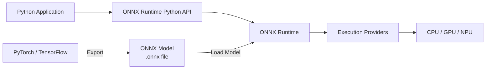
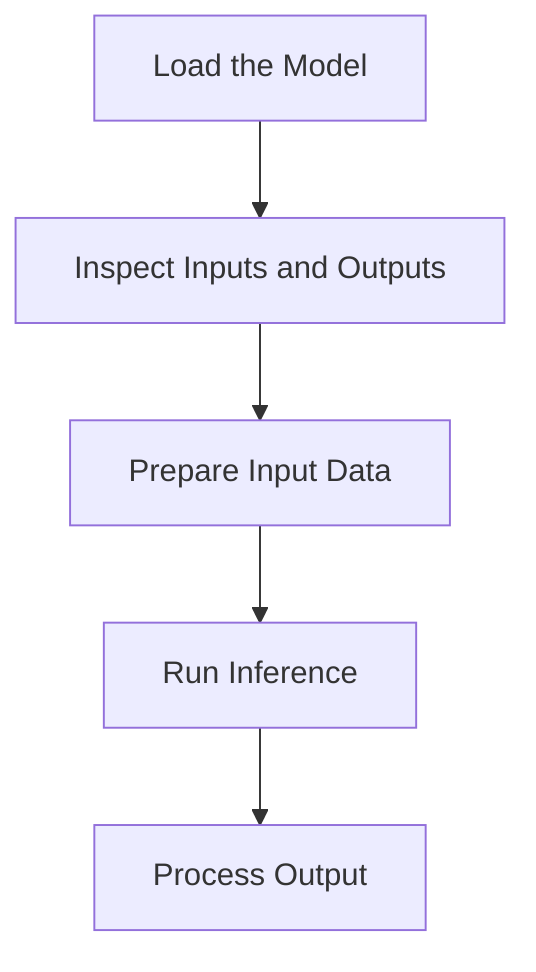
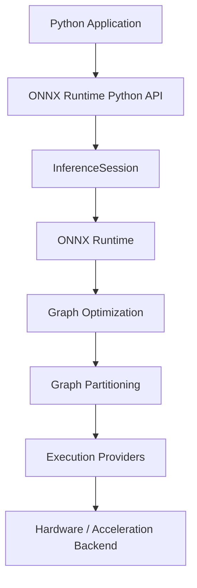

# ONNX Runtime Overview

## What is ONNX?

**ONNX** (Open Neural Network Exchange) is an open format for representing machine learning models.

It provides a common model representation that allows models trained with different machine learning frameworks to be transferred across different tools and runtimes.

For example, a model trained with PyTorch can be exported to the ONNX format and executed using ONNX Runtime.

## What is ONNX Runtime?

**ONNX Runtime** is a cross-platform inference engine for executing machine learning models in the ONNX format.

It provides APIs for integrating model inference into applications, including:

- Loading ONNX models
- Creating inference sessions
- Running inference
- Configuring execution providers

## Relationship Between ONNX and ONNX Runtime



ONNX defines the model representation, while ONNX Runtime provides the runtime environment for executing ONNX models.

Models are typically created and trained using machine learning frameworks such as PyTorch or TensorFlow, then exported to ONNX format for inference with ONNX Runtime.

## ONNX Runtime Python API

ONNX Runtime provides a Python API for loading models and running inference. See [InferenceSession API Reference](../python-api/inference-session.md) for details.

---

# Installing ONNX Runtime

This section explains how to install ONNX Runtime for Python applications and verify the installation.

## Prerequisites

Before installing ONNX Runtime, make sure that:

- Python is installed and available in your environment.
- Your Python version is supported by the ONNX Runtime release you plan to install.
- `pip` is available for installing Python packages.

For the latest Python version requirements and environment compatibility information, see the [ONNX Runtime compatibility documentation](https://onnxruntime.ai/docs/reference/compatibility.html).

## Install ONNX Runtime

ONNX Runtime provides different Python packages for different execution environments.

| Package | Use case |
|---|---|
| `onnxruntime` | Run inference on the CPU |
| `onnxruntime-gpu` | Run inference with supported GPU execution providers |

For the examples in this guide, use the CPU package. It provides the simplest setup for learning the ONNX Runtime Python API.

> **Note:** Do not install `onnxruntime` and `onnxruntime-gpu` in the same Python environment.

### Install the CPU Package

```bash
pip install onnxruntime
```

### Install the GPU Package

If your application requires GPU acceleration, install the GPU package instead:

```bash
pip install onnxruntime-gpu
```

GPU execution requires additional dependencies and a compatible execution provider. For GPU-specific requirements, see the [ONNX Runtime installation documentation](https://onnxruntime.ai/docs/install/).

## Install Example Dependencies

The first inference example also uses NumPy and Pillow for input preprocessing.

```bash
pip install numpy pillow
```

## Verify the Installation

After installing ONNX Runtime, verify that the package can be imported successfully.

```python
import onnxruntime as ort

print(ort.__version__)
```

If the installation is successful, the command prints the installed ONNX Runtime version.

## Next Steps

After verifying the installation, continue with [Running Your First Inference](first-inference.md).

---

# Running Your First Inference

This section shows how to use the ONNX Runtime Python API to run inference with the `mnist-8.onnx` model on a handwritten digit image.

## Prerequisites

Before starting, make sure that:

- ONNX Runtime is installed. See [Installing ONNX Runtime](installation.md).
- NumPy and Pillow are installed:

```bash
pip install numpy pillow
```

## Sample Files

The example uses the following files:

| File | Description |
|---|---|
| `quickstart.py` | Complete inference script |
| `mnist-8.onnx` | ONNX model for handwritten digit recognition |
| `digit.png` | Input image used by the example |

The sample files are available in the `examples/` directory of the project repository.

To get started, clone the repository:

```bash
git clone https://github.com/your-username/doc-engineering-demo.git
cd doc-engineering-demo
```

## Run the Example

Run the complete example from the repository root:

```bash
python examples/quickstart.py
```

The script prints the predicted digit for the sample image:

```text
Predicted digit: 6
```

The output depends on the input image. If you use a different image, the predicted digit may change.

## Understand the Code

### Load the Model

```python
import onnxruntime as ort

session = ort.InferenceSession("mnist-8.onnx")
```

`InferenceSession` loads the model and prepares the runtime session for inference.

### Preprocess the Input Image

The MNIST model expects a `[1, 1, 28, 28]` float32 tensor representing one grayscale image. Pixel values are normalized to `[0.0, 1.0]`.

```python
from PIL import Image
import numpy as np

# Read and convert to grayscale
image = Image.open("digit.png").convert("L")

# Resize to 28×28
image = image.resize((28, 28))

# Normalize to [0, 1]
img_array = np.array(image).astype(np.float32) / 255.0

# Match model input shape
input_data = img_array.reshape(1, 1, 28, 28)
```

### Run Inference

```python
input_name = session.get_inputs()[0].name
outputs = session.run(None, {input_name: input_data})
```

The script gets the model's input name dynamically and uses it as the key in the input dictionary.

- The first argument, `None`, requests all model outputs.
- The second argument maps the model input name to the input tensor.

### Get the Prediction

```python
predicted_digit = np.argmax(outputs[0])
print("Predicted digit:", predicted_digit)
```

For this classification model, `np.argmax()` returns the index of the highest output score, which corresponds to the predicted digit.

---

# Core Workflow: Five Steps for Any Model

Once you have an ONNX model, the basic inference workflow in the ONNX Runtime Python API can be described in five steps.



This page uses a generic model to explain the workflow. The exact input preprocessing and output processing depend on the model.

## Step 1: Load the Model

Create an [`InferenceSession`](../python-api/inference-session.md) to load the ONNX model:

```python
import onnxruntime as ort

session = ort.InferenceSession("your-model.onnx")
```

The session loads the model and prepares the runtime environment for inference.

## Step 2: Inspect Inputs and Outputs

Every model has its own input and output names, shapes, and types. Inspect the model interface before preparing input data:

```python
for inp in session.get_inputs():
    print(f"Input: name={inp.name}, shape={inp.shape}, type={inp.type}")

for out in session.get_outputs():
    print(f"Output: name={out.name}, shape={out.shape}, type={out.type}")
```

For details on these methods, see [`get_inputs()`](../python-api/inference-session.md#get_inputs) and [`get_outputs()`](../python-api/inference-session.md#get_outputs).

Use the returned metadata to prepare input data that matches the model requirements.

## Step 3: Prepare Input Data

Create input data that matches the model's expected shape and type:

```python
import numpy as np

# Replace with data that matches the model interface
input_data = np.array([...], dtype=np.float32)
```

The exact preprocessing depends on the model. For example:

- Image models may require resizing, normalization, and channel reordering.
- Text models may require tokenization and tensor conversion.
- Tabular models may require feature scaling.

Always consult the model's documentation for model-specific preprocessing requirements.

## Step 4: Run Inference

Pass the input data to [`session.run()`](../python-api/inference-session.md#run):

```python
input_name = session.get_inputs()[0].name
outputs = session.run(None, {input_name: input_data})
```

- The first argument, `None`, requests all model outputs.
- The second argument maps the input name to the input tensor.

## Step 5: Process Output

Model outputs are numerical values. Convert them into meaningful results according to the model's output definition.

For example, for a classification model:

```python
result = np.argmax(outputs[0])
print(result)
```

The interpretation of the output depends on the model. Refer to the model's documentation to understand the output format and semantics.

---

# InferenceSession API Reference

This chapter provides reference information for the `InferenceSession` class, the primary Python interface for running inference with ONNX Runtime.

## Overview

`InferenceSession` loads an ONNX model into memory and exposes methods for inspecting model metadata and executing inference.

```python
import onnxruntime as ort

session = ort.InferenceSession("model.onnx")
```

A session can be reused for multiple `run()` calls without reloading the model.

---

## Constructor

```python
ort.InferenceSession(
    path_or_bytes,
    sess_options=None,
    providers=None,
)
```

| Parameter | Type | Required | Description |
|---|---|---|---|
| `path_or_bytes` | `str` or `bytes` | Yes | Path to the ONNX model file, or serialized model bytes. |
| `sess_options` | `SessionOptions` | No | Session-level configuration such as thread count and graph optimization settings. |
| `providers` | `list[str]` | No | Execution providers to use, specified in priority order. If omitted, ONNX Runtime uses the available providers with its default precedence. |

---

## Methods

### `get_inputs()`

Returns metadata for all model inputs.

```python
inputs = session.get_inputs()
```

**Returns:** A list of `NodeArg` objects.

| Attribute | Description |
|---|---|
| `name` | Input node name. Use this as the key in `run()`. |
| `shape` | Expected tensor dimensions, for example `[1, 3, 224, 224]`. |
| `type` | Expected data type, such as `tensor(float)`. |

**Example:**

```python
for inp in session.get_inputs():
    print(f"name={inp.name}, shape={inp.shape}, type={inp.type}")
```

---

### `get_outputs()`

Returns metadata for all model outputs.

```python
outputs = session.get_outputs()
```

**Example:**

```python
for out in session.get_outputs():
    print(f"name={out.name}, shape={out.shape}, type={out.type}")
```

---

### `run()`

Executes inference with the given input data.

```python
outputs = session.run(
    output_names=None,
    input_feed={},
    run_options=None,
)
```

| Parameter | Type | Required | Description |
|---|---|---|---|
| `output_names` | `list[str]` or `None` | No | Names of outputs to return. Pass `None` to return all outputs. |
| `input_feed` | `dict` | Yes | Maps input names to input data. Keys must match the model input names. |
| `run_options` | `RunOptions` | No | Per-call execution settings. Optional for most use cases. |

**Returns:** A list containing the requested model outputs.

**Example:**

```python
input_name = session.get_inputs()[0].name
outputs = session.run(None, {input_name: input_data})
```

---

### `get_providers()`

Returns the execution providers registered for the session.

```python
providers = session.get_providers()
print(providers)
```

**Example output:**

```text
['CPUExecutionProvider']
```

Use this method when you need to inspect which execution providers are available to the session.

---

# Understanding ONNX Runtime Architecture

ONNX Runtime separates the application-facing API from the components that prepare and execute a model.

Understanding this architecture helps developers reason about model execution and execution-provider selection.

## Architecture Overview

The following diagram shows a simplified execution path for a Python application:



The main components have different responsibilities:

| Component | Responsibility |
|---|---|
| Python Application | Provides model inputs and consumes inference results |
| ONNX Runtime Python API | Provides the application interface to ONNX Runtime |
| `InferenceSession` | Loads the model and manages an inference session |
| ONNX Runtime | Builds and manages the model execution graph |
| Graph Optimization | Applies graph transformations that can improve execution efficiency |
| Graph Partitioning | Divides the graph into subgraphs that can be assigned to available execution providers |
| Execution Provider | Provides an interface between ONNX Runtime and a specific hardware or acceleration backend |
| Hardware / Acceleration Backend | Executes operations assigned to the corresponding execution provider |

## InferenceSession

[`InferenceSession`](../python-api/inference-session.md) is the primary Python interface for running an ONNX model.

When an application creates a session, ONNX Runtime loads the model and prepares the execution environment.

```python
import onnxruntime as ort

session = ort.InferenceSession("model.onnx")
```

The session provides methods for:

- Inspecting model inputs and outputs
- Running inference
- Configuring session options
- Selecting execution providers

For example:

```python
outputs = session.run(None, inputs)
```

The application does not directly invoke individual operators or hardware kernels. ONNX Runtime manages model execution through its runtime components and execution providers.

## Graph Optimization

ONNX Runtime can apply graph optimizations to improve execution efficiency.

Depending on the optimization and execution configuration, optimizations may:

- Simplify the computation graph
- Eliminate unnecessary operations
- Combine compatible operations
- Improve execution performance

Graph optimization is handled by ONNX Runtime and is generally transparent to the application.

## Graph Partitioning

After the model graph is prepared, ONNX Runtime can partition it according to the capabilities of the available execution providers.

Different subgraphs can be assigned to different providers when multiple providers are available.

This allows supported operations to run through an appropriate execution provider while other operations can fall back to another configured provider when applicable.

## Execution Providers

Execution Providers (EPs) connect ONNX Runtime to specific hardware or acceleration libraries.

Examples include providers for:

- CPU
- NVIDIA CUDA
- TensorRT
- DirectML
- Other supported hardware backends

An application can specify execution providers when creating an `InferenceSession`:

```python
session = ort.InferenceSession(
    "model.onnx",
    providers=["CUDAExecutionProvider", "CPUExecutionProvider"]
)
```

The provider order determines the priority in which providers are considered for execution.

If multiple providers are configured, ONNX Runtime can partition the model graph and assign supported subgraphs to the appropriate provider.

> **Note:** GPU execution providers may require additional packages, libraries, drivers, or other environment dependencies.

## Model Execution

The execution path can be summarized as:

```text
Python Application
        ↓
ONNX Runtime Python API
        ↓
InferenceSession
        ↓
Load ONNX Model
        ↓
Graph Optimization
        ↓
Graph Partitioning
        ↓
Execution Providers
        ↓
Hardware / Acceleration Backend
        ↓
Inference Results
```

The exact execution path depends on the model, session configuration, and available execution providers.

## Why This Architecture Matters

Understanding the architecture helps developers:

- Select an appropriate execution provider
- Understand how model operations are assigned to providers
- Reason about hardware compatibility
- Investigate inference performance
- Understand provider-related execution behavior

For the general inference procedure, see [Five Steps for Any Model](../core-flow/five-steps.md).

For Python API details, see [InferenceSession API Reference](../python-api/inference-session.md).
