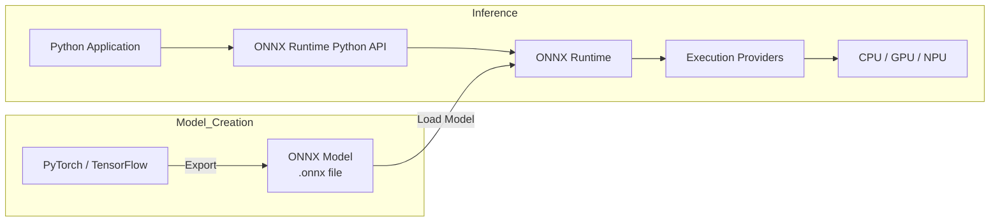
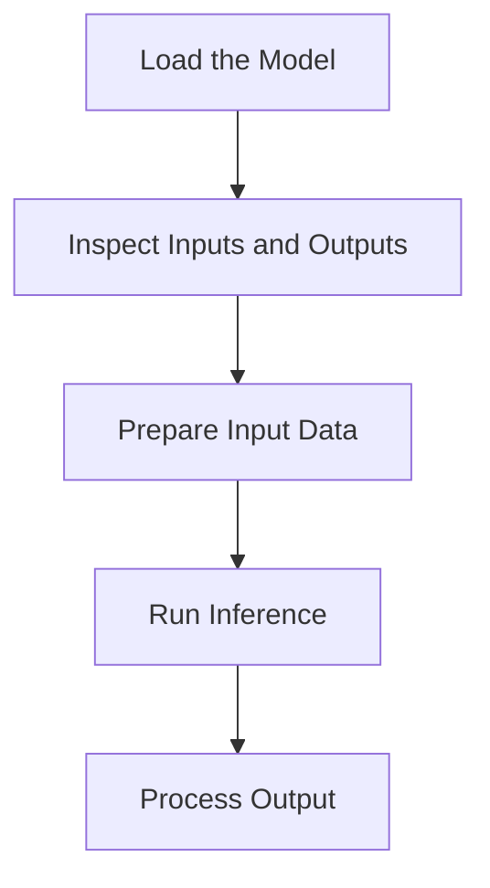

# ONNX Runtime Overview

## What is ONNX?

**ONNX** (Open Neural Network Exchange) is an open format for representing machine learning models.

It provides a common model representation that allows models trained with different machine learning frameworks to be transferred across different tools and runtimes.

For example, a model trained with PyTorch can be exported to the ONNX format and executed using ONNX Runtime.


## What is ONNX Runtime?

**ONNX Runtime** is a cross-platform inference engine for executing machine learning models in the ONNX format.

It provides APIs for integrating model inference into applications, including:

- Loading ONNX models
- Creating inference sessions
- Running inference
- Configuring execution providers


## Relationship Between ONNX and ONNX Runtime



ONNX defines the model format, while ONNX Runtime provides the execution environment for running ONNX models.

Models are typically created and trained using machine learning frameworks such as PyTorch or TensorFlow, then exported to ONNX format for inference with ONNX Runtime.


## ONNX Runtime Python API

ONNX Runtime provides a Python API for loading models and running inference. See [Python API](../python-api/inference-session.md) for details.

---

# Installing ONNX Runtime

This section explains how to install ONNX Runtime for Python applications and verify that the installation is working correctly.

## Prerequisites

Before installing ONNX Runtime, make sure that:

- Python is installed and available in your environment.
- Your Python version is supported by the ONNX Runtime release you plan to install.
- `pip` is available for installing Python packages.

For the latest Python version requirements and environment compatibility information, see the [ONNX Runtime compatibility documentation](https://onnxruntime.ai/docs/reference/compatibility.html).

## Installing ONNX Runtime

ONNX Runtime provides different Python packages for different execution environments.

| Package | Use case |
|---|---|
| `onnxruntime` | Run inference on the CPU |
| `onnxruntime-gpu` | Run inference with supported GPU execution providers |

For this guide, use the CPU package. It provides the simplest setup for learning the ONNX Runtime Python API and running the examples in this documentation.

> **Note:** Do not install `onnxruntime` and `onnxruntime-gpu` in the same Python environment.

### Install the CPU Package

Install the CPU package with `pip`:

```bash
pip install onnxruntime
```

### Install the GPU Package

If your application requires GPU acceleration, install the GPU package instead:

```bash
pip install onnxruntime-gpu
```

GPU execution requires additional dependencies and a compatible execution provider. For GPU-specific requirements, see the [ONNX Runtime installation documentation](https://onnxruntime.ai/docs/install/).

## Verifying the Installation

After installing ONNX Runtime, verify that the package can be imported successfully.

Run:

```python
import onnxruntime as ort

print(ort.__version__)
```

If the installation is successful, the command prints the installed ONNX Runtime version.

## Next Steps

After verifying the installation, continue with [Running Your First Inference](first-inference.md).


---

# Running Your First Inference

This section shows how to use the ONNX Runtime Python API to run inference with the `mnist-8.onnx` model on a real handwritten digit image.

## Prerequisites

### Software Requirements

Before starting, make sure that:

- ONNX Runtime is installed. See [Installing ONNX Runtime](installation.md).
- Pillow is installed for image preprocessing:

  ```bash
  pip install pillow
  ```

### Sample Files

All files used in this tutorial are available in the
[`examples/` directory on GitHub](https://github.com/你的用户名/doc-engineering-demo/tree/main/examples).

| File | Description |
|------|-------------|
| `quickstart.py` | Complete inference script. You can run it directly. |
| `mnist-8.onnx` | ONNX model file for handwritten digit recognition. |
| `digit.png` | A 28×28 grayscale image of a handwritten digit, with a black background and a white foreground. |

To get started, clone the repository and enter the `examples/` directory:

```bash
git clone https://github.com/你的用户名/doc-engineering-demo.git
cd doc-engineering-demo/examples
```

## Run the Complete Example

Run the provided script to see ONNX Runtime in action:

```bash
cd examples
python quickstart.py
```

If you use the sample image `digit.png`, the script prints:

```text
Predicted digit: 6
```

This confirms that ONNX Runtime successfully loaded the model, preprocessed the input image, ran inference, and returned the correct prediction.

> **Note:** The output depends on the input image. If you use a different image, the predicted digit will change accordingly.

To adapt this script to your own model, see the step-by-step explanation below.

## Understand the Code

### Load the Model

```python
import onnxruntime as ort

session = ort.InferenceSession("mnist-8.onnx")
```

`InferenceSession` loads the model into memory and prepares it for inference.

### Preprocess the Input Image

The MNIST model expects a `[1, 1, 28, 28]` float32 tensor representing one grayscale image. Pixel values must be normalized to `[0.0, 1.0]`.

```python
from PIL import Image
import numpy as np

# Read and convert to grayscale
image = Image.open("digit.png").convert("L")

# Resize to 28×28
image = image.resize((28, 28))

# Normalize to [0, 1]
img_array = np.array(image).astype(np.float32) / 255.0

# Match model input shape
input_data = img_array.reshape(1, 1, 28, 28)
```

### Run Inference

```python
input_name = session.get_inputs()[0].name
outputs = session.run(None, {input_name: input_data})
```

The script uses `session.get_inputs()[0].name` to get the model's input name dynamically, so it also works for models with different input names.

- The first argument, `None`, tells ONNX Runtime to return all model outputs.
- The second argument maps the model's input name to the input tensor.

### Get the Prediction

```python
predicted_digit = np.argmax(outputs[0])
print("Predicted digit:", predicted_digit)
```

`np.argmax` returns the index of the highest score, which corresponds to the predicted digit.


---

# Core Workflow: Five Steps for Any Model

Once you have an ONNX model, the basic inference workflow in the ONNX Runtime Python API follows the same five steps, regardless of the model type.



This page describes each step using a generic model to illustrate the workflow.

---

## Step 1: Load the Model

Create an [`InferenceSession`](../python-api/inference-session.md) to load the ONNX model into memory:

```python
import onnxruntime as ort

session = ort.InferenceSession("your-model.onnx")
```

The session loads the model and prepares it for inference.

---

## Step 2: Inspect Inputs and Outputs

Every model has its own input and output names, shapes, and types. Before preparing input data, inspect the model interface:

```python
for inp in session.get_inputs():
    print(f"Input: name={inp.name}, shape={inp.shape}, type={inp.type}")

for out in session.get_outputs():
    print(f"Output: name={out.name}, shape={out.shape}, type={out.type}")
```

For details on these methods, see [`get_inputs()`](../python-api/inference-session.md#get_inputs) and [`get_outputs()`](../python-api/inference-session.md#get_outputs).

Use the returned information to prepare input data that matches the model requirements.

---

## Step 3: Prepare Input Data

Create a NumPy array that matches the model's expected input shape and type:

```python
import numpy as np

# Replace with the shape and type returned in Step 2
input_data = np.array([...], dtype=np.float32)
```

The exact data preparation depends on your model. For example:

- Image models may require resizing, normalization, and channel reordering.
- Text models may require tokenization and tensor conversion.
- Tabular models may require feature scaling.

Always consult the model's documentation for preprocessing requirements.

---


## Step 4: Run Inference

Pass the input data to [`session.run()`](../python-api/inference-session.md#run):

```python
input_name = session.get_inputs()[0].name
outputs = session.run(None, {input_name: input_data})
```

- The first argument, None, returns all model outputs.
- The second argument maps the input name to the input tensor.

## Step 5: Process Output

Model outputs are raw numerical values. Convert them into meaningful results according to your model:

```python
result = np.argmax(outputs[0])  # Example: classification output
print(result)
```

The interpretation of the output depends on the model. Refer to the model's documentation to understand the output format and semantics.

---


---

# InferenceSession API Reference

This chapter provides reference information for the `InferenceSession` class, which is the primary entry point for running inference with ONNX Runtime.

## Overview

`InferenceSession` loads an ONNX model into memory and exposes methods for inspecting model metadata and executing inference.

```python
import onnxruntime as ort

session = ort.InferenceSession("model.onnx")
```

Once created, a session can be reused for multiple `run()` calls without reloading the model.

---

## Constructor

```python
ort.InferenceSession(
    path_or_bytes,
    sess_options=None,
    providers=None,
)
```

| Parameter | Type | Required | Description |
|-----------|------|----------|-------------|
| `path_or_bytes` | `str` or `bytes` | Yes | Path to the ONNX model file, or serialized model bytes. |
| `sess_options` | `SessionOptions` | No | Session-level configuration such as thread count and graph optimization level. |
| `providers` | `list[str]` | No | List of execution providers. Defaults to all available providers. |

---

## Methods

### `get_inputs()`

Returns metadata for all model inputs.

```python
inputs = session.get_inputs()
```

**Returns:** A list of `NodeArg` objects.

| Attribute | Description |
|-----------|-------------|
| `name` | Input node name. Use this as the key in `run()`. |
| `shape` | Expected tensor dimensions, for example `[1, 3, 224, 224]`. |
| `type` | Expected data type, such as `tensor(float)`. |

**Example:**

```python
for inp in session.get_inputs():
    print(f"name={inp.name}, shape={inp.shape}, type={inp.type}")
```

---

### `get_outputs()`

Returns metadata for all model outputs. The return format is identical to `get_inputs()`.

```python
outputs = session.get_outputs()
```

**Example:**

```python
for out in session.get_outputs():
    print(f"name={out.name}, shape={out.shape}, type={out.type}")
```

---

### `run()`

Executes inference with the given input data.

```python
outputs = session.run(
    output_names=None,
    input_feed={},
    run_options=None,
)
```

| Parameter | Type | Required | Description |
|-----------|------|----------|-------------|
| `output_names` | `list[str]` or `None` | No | Names of outputs to return. Pass `None` to return all outputs. |
| `input_feed` | `dict` | Yes | Maps input names to NumPy arrays. Keys must match `get_inputs()[i].name`. |
| `run_options` | `RunOptions` | No | Per-call execution settings. Optional for most use cases. |

**Returns:** A list of NumPy arrays, one for each requested output.

**Example:**

```python
input_name = session.get_inputs()[0].name
outputs = session.run(None, {input_name: input_data})
```

---

### `get_providers()`

Returns the execution providers available to this session.

```python
providers = session.get_providers()
print(providers)
```

**Example output:**

```
['CPUExecutionProvider']
```

For most basic use cases, you do not need to interact with this method directly.

---

## Common Usage Pattern

The following example shows the typical sequence of calls in a single inference task:

```python
import onnxruntime as ort
import numpy as np

# 1. Load the model
session = ort.InferenceSession("model.onnx")

# 2. Inspect the input interface
input_name = session.get_inputs()[0].name
input_shape = session.get_inputs()[0].shape

# 3. Prepare input data matching the expected shape and type
input_data = np.random.rand(*input_shape).astype(np.float32)

# 4. Run inference
outputs = session.run(None, {input_name: input_data})

# 5. Process the output
result = outputs[0]
```

---


---

# Understanding ONNX Runtime Architecture

ONNX Runtime separates the application-facing API from the components that execute a model on the target hardware.

Understanding this architecture helps developers configure execution providers, troubleshoot inference issues, and reason about runtime behavior.

## Architecture Overview

The following diagram shows the main components involved when a Python application runs an ONNX model:

```mermaid
flowchart TD

    A[Python Application] --> B[ONNX Runtime Python API]
    B --> C[InferenceSession]
    C --> D[ONNX Runtime]
    D --> E[Graph Optimization]
    E --> F[Execution Provider]
    F --> G[CPU / GPU / NPU]
````

The main components have different responsibilities:

| Component               | Responsibility                                       |
| ----------------------- | ---------------------------------------------------- |
| Python Application      | Provides model inputs and consumes inference results |
| ONNX Runtime Python API | Provides the application interface to ONNX Runtime   |
| `InferenceSession`      | Loads the model and manages an inference session     |
| ONNX Runtime            | Builds and executes the inference graph              |
| Graph Optimization      | Optimizes the graph before execution                 |
| Execution Provider      | Provides hardware-specific execution capabilities    |
| CPU / GPU / NPU         | Executes the model operations                        |

## InferenceSession

[`InferenceSession`](../python-api/inference-session.md) is the primary Python interface for running an ONNX model.

When an application creates a session, ONNX Runtime loads the model and prepares the execution environment.

```python
import onnxruntime as ort

session = ort.InferenceSession("model.onnx")
```

The session provides methods for:

* Inspecting model inputs and outputs
* Running inference
* Configuring session options
* Selecting execution providers

For example:

```python
outputs = session.run(None, inputs)
```

The application does not directly invoke individual operators or hardware kernels. ONNX Runtime manages these details during execution.

## Graph Optimization

Before executing a model, ONNX Runtime can apply graph optimizations to improve execution efficiency.

These optimizations may:

* Simplify the computation graph
* Eliminate unnecessary operations
* Combine compatible operations
* Improve execution performance

The optimized graph is then used for inference.

Graph optimization is handled by ONNX Runtime and is generally transparent to the application.

## Execution Providers

Execution Providers (EPs) connect ONNX Runtime to specific hardware or acceleration libraries.

Examples include providers for:

* CPU
* NVIDIA CUDA
* TensorRT
* DirectML
* Other supported hardware backends

An application can specify execution providers when creating an `InferenceSession`:

```python
session = ort.InferenceSession(
    "model.onnx",
    providers=["CUDAExecutionProvider", "CPUExecutionProvider"]
)
```

The provider order determines the priority in which providers are considered for execution.

If multiple providers are configured, ONNX Runtime can partition the model graph and assign supported operations to the appropriate provider.

## Model Execution

The complete execution path can be summarized as:

```text
Python Application
        ↓
InferenceSession
        ↓
Load ONNX Model
        ↓
Graph Optimization
        ↓
Graph Partitioning
        ↓
Execution Provider
        ↓
Hardware Execution
        ↓
Inference Results
```

This architecture allows the same application-level inference code to work across different hardware configurations while ONNX Runtime handles hardware-specific execution.

## Why This Architecture Matters

Understanding the architecture helps when:

* Selecting an execution provider
* Diagnosing provider or hardware compatibility issues
* Understanding why a model runs on a specific device
* Investigating inference performance
* Troubleshooting unsupported operators

For the general inference procedure, see [Five Steps for Any Model](../core-flow/five-steps.md).

For Python API details, see [InferenceSession API Reference](../python-api/inference-session.md).


